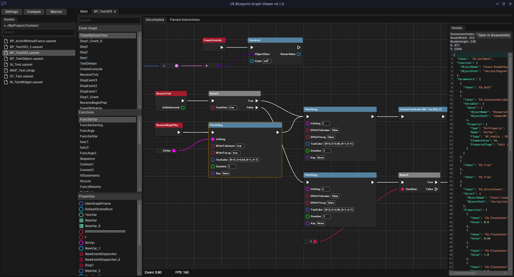

# UE Blueprint Graph Viewer

A tool for viewing compiled blueprint code of Unreal Engine 4-5 games. 4.25 and later versions are supported.

### Features roadmap
Blueprint decompilation:
- Basic decompilation: done
- Loops: done
- Macros: mostly done (some built-in macros are missing)
- Timelines: done
- Input events: partially done
- Delegates: done
- Functions with multiple exec pins: not yet
- Anim BPs: not yet

References search:
- Basic asset reference search: done
- Search for unreferenced assets: done but might be inaccurate
- Search for variable or function usage: not yet
- Search inside a graph: not yet

Not sure if i will do that:
- Blueprints compilation
- Runtime blueprint debugger

### How to use

1. Install dev version of [UE4SS](https://github.com/UE4SS-RE/RE-UE4SS) and a C++ mod for it to dump reflection data.
Mod was tested on [zDEV-UE4SS_v3.0.1-1016-g6c26f038.zip](https://github.com/UE4SS-RE/RE-UE4SS/releases/download/experimental/zDEV-UE4SS_v3.0.1-1016-g6c26f038.zip). It may not work in different versions.

2. Make a dump. Open a UE Function Dump tab in UE4SS debug window, check "Load all assets into memory" (unless game crashes before dump is completed, or you don't have enough RAM), press "Dump" and wait. The dump will be located in Win64 folder and called dump.txt. You need to create a new dump when the game updates.

3. Launch the program and create new profile for your game. Provide a .usmap or .jmap mappings if needed.

### Reflection dumper

To correctly display function parameters, types and more we need to get some reflection data about classes, functions and properties. Especially for native classes. Unfortunately, we can't use .usmap and .jmap files because they are not providing enough information.

### Loops and macros

Several engine's control flow nodes (including loops) are actually just BP macros, and they are getting inlined during compilation. The tool tries to find all possible macro instances in a graph and replace them with macro calls. The tool is shipped with some of the engine built-in macros. Creating your own macros is possible but very limited for now.

### Compare two game builds

You can compare blueprints of two different versions of the game. To open a comparing mode settings, press "Compare" button at the top left. Diff view might be inaccurate.

### References search

Searching for reference is currently limited and possibly inaccurate. More search features will be added later.
